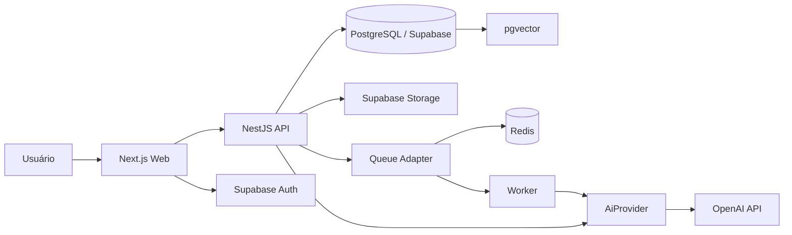

# Arquitetura de Software — Orbit

## Estratégia

Arquitetura **modular monolith** em monorepo. É uma estrutura profissional, simples de operar no início e preparada para extração futura de serviços quando houver escala real.

## Stack definida

### Runtime e workspace
- Node.js 24 LTS
- TypeScript
- npm workspaces
- Turborepo

### Frontend — `apps/web`
- Next.js 16 (App Router)
- React 19.3
- Tailwind CSS 4.x
- shadcn/ui como base de componentes acessíveis
- TanStack Query para estado servidor/client fetching quando necessário
- React Hook Form + Zod para formulários
- Zustand apenas para estado efêmero/local de UI
- Lucide Icons
- next-themes

### Backend — `apps/api`
- NestJS 12, ESM
- Fastify adapter
- OpenAPI/Swagger
- Zod/Standard Schema nos limites de entrada
- arquitetura por módulos de domínio
- rate limiting
- health/readiness endpoints

### Dados
- PostgreSQL gerenciado por Supabase
- Supabase Auth
- Supabase Storage
- Row Level Security (RLS)
- Drizzle ORM + SQL migrations versionadas
- pgvector para embeddings quando RAG for habilitado

### Jobs e cache
- Upstash Redis ou Redis compatível em produção
- BullMQ para tarefas assíncronas pesadas
- no desenvolvimento inicial, jobs podem rodar inline atrás de uma interface de queue

### IA
- `AiProvider` abstrato dentro da API
- primeiro provider: OpenAI API
- structured outputs para respostas consumidas pelo sistema
- embeddings + pgvector para RAG de materiais
- prompts versionados no repositório
- nenhuma chave de IA no cliente

### Observabilidade
- OpenTelemetry
- Sentry (front e API)
- logs estruturados (Pino)
- correlation/request id

### Testes
- Vitest: unitários e integração
- Playwright: E2E web
- Testcontainers quando necessário para integração com Postgres/Redis

### CI/CD
- GitHub Actions
- Web: Vercel
- API: Railway, Render ou Fly.io (container Docker)
- Banco/Auth/Storage: Supabase

## Diagrama de containers



## Monorepo

```text
orbit/
├─ apps/
│  ├─ web/
│  ├─ api/
│  └─ worker/              # só quando queue real for ativada
├─ packages/
│  ├─ contracts/           # schemas e DTOs compartilhados
│  ├─ design-system/       # tokens + componentes Orbit
│  ├─ config-eslint/
│  ├─ config-typescript/
│  └─ observability/
├─ infra/
│  ├─ docker/
│  └─ supabase/
├─ docs/
├─ .github/workflows/
├─ package.json            # npm workspaces
├─ package-lock.json
└─ turbo.json
```

## Módulos da API

```text
src/modules/
├─ auth/
├─ users/
├─ semesters/
├─ subjects/
├─ schedules/
├─ tasks/
├─ assessments/
├─ focus/
├─ study-plans/
├─ materials/
├─ ai/
├─ analytics/
└─ notifications/
```

Cada módulo deve conter seu domínio, application services/use cases, adapters/repositories e controllers. Não importe internals de outro módulo; use serviços públicos, eventos ou contratos.

## Fluxo de autenticação

1. Web autentica via Supabase Auth.
2. Web recebe sessão/JWT.
3. Requisições à API levam Bearer token.
4. API valida assinatura/claims.
5. `userId` da sessão define o escopo.
6. RLS no Postgres funciona como segunda barreira para caminhos que usam Supabase diretamente.

## Princípios arquiteturais

- Controller fino, regra em service/use case.
- Domínio não conhece HTTP nem SDK de IA.
- Infraestrutura é substituível por adapters.
- Eventos internos para efeitos colaterais.
- Idempotência em criação via jobs/webhooks.
- UTC no banco; timezone do usuário na apresentação.
- Soft delete somente onde houver valor real; preferir histórico/audit quando necessário.
- Nunca armazenar segredo no cliente.

## Evolução futura

Somente extrair um módulo para serviço independente se houver pelo menos um motivador concreto: escala separada, limites de segurança, ciclo de deploy próprio ou equipe dedicada. Candidatos naturais: AI/worker e notifications.
